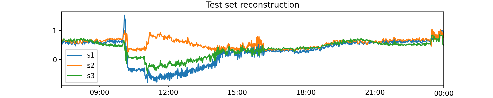
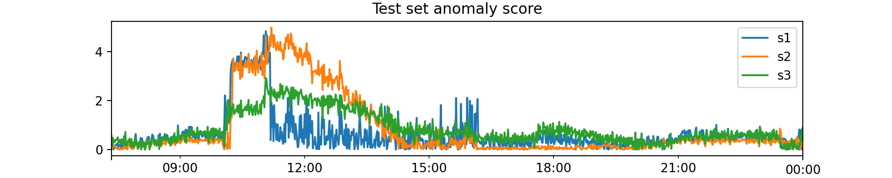

# numalogic

[](https://github.com/numaproj/numalogic/actions/workflows/ci.yml)
[](https://codecov.io/gh/numaproj/numalogic)
[](https://github.com/ambv/black)
[](LICENSE)
[](https://join.slack.com/t/numaproj/shared_invite/zt-19svuv47m-YKHhsQ~~KK9mBv1E7pNzfg)
[](https://github.com/numaproj/numalogic/releases/latest)


## Background
Numalogic is a collection of ML models and algorithms for operation data analytics and AIOps. 
At Intuit, we use Numalogic at scale for continuous real-time data enrichment including 
anomaly scoring. We assign an anomaly score (ML inference) to any time-series 
datum/event/message we receive on our streaming platform (say, Kafka). 95% of our 
data sets are time-series, and we have a complex flowchart to execute ML inference on 
our high throughput sources. We run multiple models on the same datum, say a model that is 
sensitive towards +ve sentiments, another more tuned towards -ve sentiments, and another 
optimized for neutral sentiments. We also have a couple of ML models trained for the same 
data source to provide more accurate scores based on the data density in our model store. 
An ensemble of models is required because some composite keys in the data tend to be less 
dense than others, e.g., forgot-password interaction is less frequent than a status check 
interaction. At runtime, for each datum that arrives, models are picked based on a conditional 
forwarding filter set on the data density. ML engineers need to worry about only their 
inference container; they do not have to worry about data movement and quality assurance.

## Numalogic realtime training 
For an always-on ML platform, the key requirement is the ability to train or retrain models 
automatically based on the incoming messages. The composite key built at per message runtime 
looks for a matching model, and if the model turns out to be stale or missing, an automatic 
retriggering is applied. The conditional forwarding feature of the platform improves the 
development velocity of the ML developer when they have to make a decision whether to forward 
the result further or drop it after a trigger request.


## Installation

numalogic can be installed using pip.
```shell
pip install numalogic
```

If using mlflow for model registry, install using:
```shell
pip install numalogic[mlflow]
```

### Build locally

1. Install [Poetry](https://python-poetry.org/docs/):
    ```
    curl -sSL https://install.python-poetry.org | python3 -
    ```
2. To activate virtual env:
    ```
    poetry shell
    ```
3. To install dependencies:
    ```
    poetry install
    ```
   If extra dependencies are needed:
    ```
    poetry install --all-extras
    ```
4. To run unit tests:
    ```
    make test
    ```
5. To format code style using black:
    ```
    make lint
    ```

## Usage
The following example shows a series of operations that can be performed using the package.
### Generate synthetic data
Let's start with generating some synthetic time series data using numalogic's synthetic module.
```python
from numalogic.synthetic import SyntheticTSGenerator

ts_generator = SyntheticTSGenerator(
    seq_len=8000,
    num_series=3,
    freq="T",
    primary_period=720,
    secondary_period=6000,
    seasonal_ts_prob=0.8,
    baseline_range=(200.0, 350.0),
    slope_range=(-0.001, 0.01),
    amplitude_range=(10, 75),
    cosine_ratio_range=(0.5, 0.9),
    noise_range=(5, 15),
)
ts_df = ts_generator.gen_tseries()  # shape: (8000, 3) with column names [s1, s2, s3]

# Split into test and train
train_df, test_df = ts_generator.train_test_split(ts_df, test_size=1000)
```


### Generate synthetic anomalies
Now we will add "contextual" anomalies in the test set, using numalogic's AnomalyGenerator.
Contextual is one of the different types of anomalies that can be imputed. Others include "point", "collective"
and "causal".
```python
from numalogic.synthetic import AnomalyGenerator

injected_cols = ["s1", "s2"]  # columns to inject anomalies
anomaly_generator = AnomalyGenerator(
    train_df, anomaly_type="contextual", anomaly_ratio=0.3
)
outlier_test_df = anomaly_generator.inject_anomalies(
    test_df, cols=injected_cols, impact=1.5
)
```


### Model training 
Let's use one of the available models to train on generated data.
Here we are going to use a sparse convolutional Autoencoder.
We can start by scaling the data.
```python
from sklearn.preprocessing import MinMaxScaler
from numalogic.models.autoencoder.variants import Conv1dAE
from numalogic.models.autoencoder.pipeline import SparseAEPipeline

# Scale the train and test sets.
scaler = MinMaxScaler()
X_train = scaler.fit_transform(train_df.to_numpy())

# Define the model and train
seq_len = 36
# SparseAEPipeline is a sparse autoencoder trainer that follows sklearn's API pattern
model = SparseAEPipeline(
    model=Conv1dAE(in_channels=3, enc_channels=8), seq_len=seq_len, num_epochs=30
)
model.fit(X_train)
```

### Model saving
Now that the model is trained, let's save it. Numalogic has built in support 
for Mlflow's tracking and logging system.

Let's first start the [mlflow server on localhost](https://www.mlflow.org/docs/latest/tracking.html#scenario-1-mlflow-on-localhost),
which has already been installed optionally via `poetry` dependency:
```shell
mlflow server \
        --default-artifact-root {directory}/mlruns --serve-artifacts \
        --backend-store-uri sqlite:///mlflow.db --host 0.0.0.0 --port 5000
```
```python
from numalogic.registry import MLflowRegistrar

# static and dynamic keys are used to look up a model
static_keys = ["synthetic", "3ts"]
dynamic_keys = ["minmaxscaler", "sparseconv1d"]

registry = MLflowRegistrar(tracking_uri="http://0.0.0.0:5000", artifact_type="pytorch")
registry.save(
   skeys=static_keys, 
   dkeys=dynamic_keys, 
   primary_artifact=model, 
   secondary_artifacts={"preproc": scaler}
)
```

### Model loading
Let's now load the model for inference on test data
```python
registry = MLflowRegistrar(tracking_uri="http://0.0.0.0:8080")
artifact_dict = registry.load(
    skeys=static_keys, dkeys=dynamic_keys
)
scaler = artifact_dict["secondary_artifacts"]["preproc"]
model = artifact_dict["primary_artifact"]
```

### Model inference
Finally, let's use the loaded artifacts to predict on the anomalous test data.
This can be a streaming or a batched data.
```python
X_test = scaler.transform(outlier_test_df.to_numpy())

# predict method returns the reconstruction produced by the AE
test_recon = model.predict(X_test)

# score method returns the anomaly score, calculated using thresholds.
# A number less than 1 indicates an inlier, and greater than 1 indicates an outlier.
test_anomaly_score = model.score(X_test)
```



## Contributing
We would love contributions in the numalogic project in one of the following (but not limited to) areas:

- Adding new time series anomaly detection models
- Making it easier to add user's custom models
- Support for additional model registry frameworks

For contribution guildelines please refer [here](https://github.com/numaproj/numaproj/blob/main/CONTRIBUTING.md).