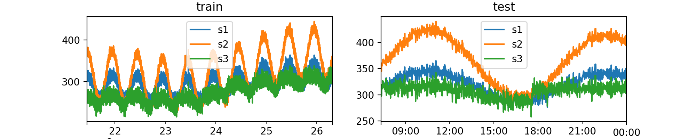
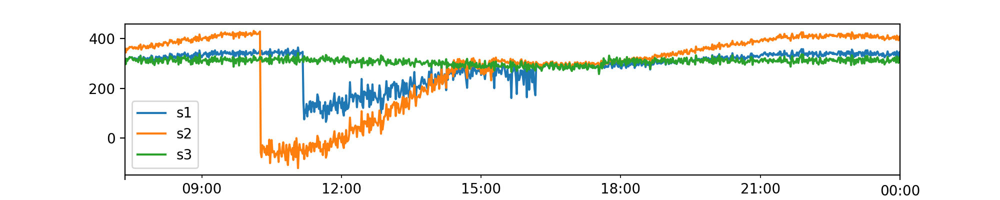

## Data Generator

### Generate synthetic data
Numalogic provides a data generator to create some synthetic time series data, that can be used as train or test data sets.  

```python
from numalogic.synthetic import SyntheticTSGenerator

ts_generator = SyntheticTSGenerator(
    seq_len=8000,
    num_series=3,
    freq="T",
    primary_period=720,
    secondary_period=6000,
    seasonal_ts_prob=0.8,
    baseline_range=(200.0, 350.0),
    slope_range=(-0.001, 0.01),
    amplitude_range=(10, 75),
    cosine_ratio_range=(0.5, 0.9),
    noise_range=(5, 15),
)
ts_df = ts_generator.gen_tseries()  # shape: (8000, 3) with column names [s1, s2, s3]

# Split into test and train
train_df, test_df = ts_generator.train_test_split(ts_df, test_size=1000)
```


### Generate synthetic anomalies

Now, once we generate the synthetic data like above, we can also add  "contextual" anomalies to the test set, using numalogic's AnomalyGenerator.
Contextual is one of the different types of anomalies that can be imputed. Others include "point", "collective"
and "causal".

```python
from numalogic.synthetic import AnomalyGenerator

injected_cols = ["s1", "s2"]  # columns to inject anomalies
anomaly_generator = AnomalyGenerator(
    train_df, anomaly_type="contextual", anomaly_ratio=0.3
)
outlier_test_df = anomaly_generator.inject_anomalies(
    test_df, cols=injected_cols, impact=1.5
)
```

