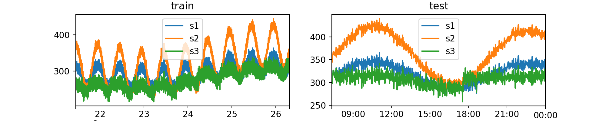
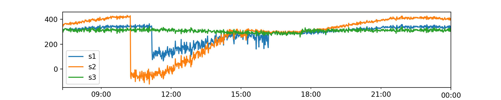

# Data Generator

Numalogic provides a data generator to create some synthetic time series data, that can be used as train or test data sets.

Using the synthetic data, we can:

1. Compare and evaluate different ML algorithms, since we have labeled anomalies
2. Understand different types of anomalies, and our models' performance on each of them
3. Recreate realtime scenarios

### Generate multivariate timeseries

```python
from numalogic.synthetic import SyntheticTSGenerator

ts_generator = SyntheticTSGenerator(
    seq_len=8000,
    num_series=3,
    freq="T",
    primary_period=720,
    secondary_period=6000,
    seasonal_ts_prob=0.8,
    baseline_range=(200.0, 350.0),
    slope_range=(-0.001, 0.01),
    amplitude_range=(10, 75),
    cosine_ratio_range=(0.5, 0.9),
    noise_range=(5, 15),
)

# shape: (8000, 3) with column names [s1, s2, s3]
ts_df = ts_generator.gen_tseries()

# Split into test and train
train_df, test_df = ts_generator.train_test_split(ts_df, test_size=1000)
```


### Inject anomalies

Now, once we generate the synthetic data like above, we can inject anomalies into the test data set using `AnomalyGenerator`.

`AnomalyGenerator` supports the following types of anomalies:

1. global: Outliers in the global context
2. contextual: Outliers only in the seasonal context
3. causal: Outliers caused by a temporal causal effect
4. collective: Outliers present simultaneously in two or more time series

You can also use `anomaly_ratio` to adjust the ratio of anomalous data points  wrt number of samples.

```python
from numalogic.synthetic import AnomalyGenerator

# columns to inject anomalies
injected_cols = ["s1", "s2"]
anomaly_generator = AnomalyGenerator(
    train_df, anomaly_type="contextual", anomaly_ratio=0.3
)
outlier_test_df = anomaly_generator.inject_anomalies(
    test_df, cols=injected_cols, impact=1.5
)
```


