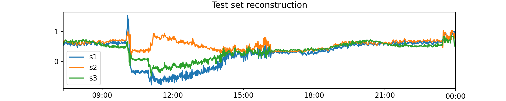

# Inference

Now, once we have the model trained using one of the ML algorthims, we can predict the anomalies in the test data.

This can be a streaming or a batched data.

```python
X_test = scaler.transform(outlier_test_df.to_numpy())

# predict method returns the reconstruction produced by the AE
test_recon = model.predict(X_test)

# score method returns the anomaly score, calculated using thresholds.
# A number less than 1 indicates an inlier, and greater than 1 indicates an outlier.
test_anomaly_score = model.score(X_test)
```



