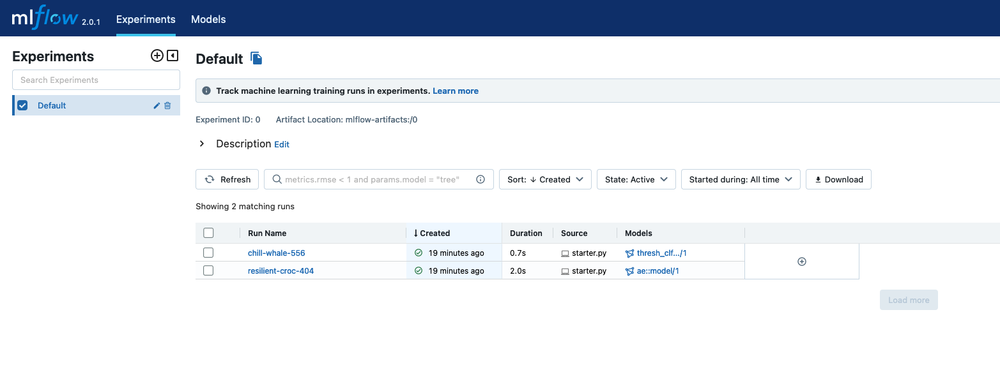
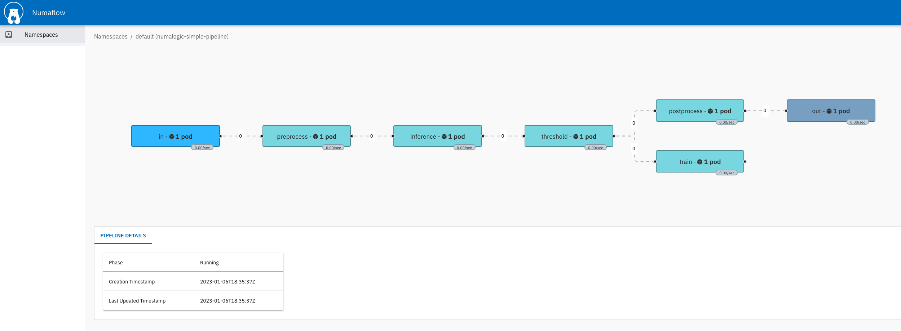

# Quick Start

## Installation

### Install pytorch-lightning
Numalogic needs [PyTorch](https://pytorch.org/) and
[PyTorch Lightning](https://pytorch-lightning.readthedocs.io/en/stable/) to work.
You can install simply by:
```shell
pip install pytorch-lightning
```
Or you can install your platform specific torch version from their website.


### Install Numalogic

```shell
pip install numalogic
```

## Numalogic as a Library

Numalogic can be used as an independent library, and it provides various ML models and tools. Here, we are using the `AutoencoderTrainer`. Refer to [training section](autoencoders.md) for other available options.

In this example, the train data set has numbers ranging from 1-10. Whereas in the test data set, there are data points that go out of this range, which the algorithm should be able to detect as anomalies.

```python
import numpy as np
from sklearn.preprocessing import StandardScaler
from torch.utils.data import DataLoader
from numalogic.models.autoencoder import AutoencoderTrainer
from numalogic.models.autoencoder.variants import VanillaAE
from numalogic.models.threshold import StdDevThreshold
from numalogic.transforms import TanhNorm
from numalogic.tools.data import StreamingDataset

# Create some synthetic data
X_train = np.array([1, 3, 5, 2, 5, 1, 4, 5, 1, 4, 5, 8, 9, 1, 2, 4, 5, 1, 3]).reshape(
    -1, 1
)
X_test = np.array([-20, 3, 5, 60, 5, 10, 4, 5, 200]).reshape(-1, 1)

# Preprocess step
clf = StandardScaler()
train_data = clf.fit_transform(X_train)
test_data = clf.transform(X_test)
print(train_data)
print(test_data)

# Set a sequence length.
SEQ_LEN = 8

# Define the model. We are using a simple fully connected autoencoder here.
model = VanillaAE(seq_len=SEQ_LEN, n_features=1)

# Create a torch dataset
train_dataset = StreamingDataset(train_data, seq_len=SEQ_LEN)

# Define the trainer, and fit the model.
trainer = AutoencoderTrainer(max_epochs=30, enable_progress_bar=True)
trainer.fit(model, train_dataloaders=DataLoader(train_dataset))

# Get the training reconstruction error from the model.
train_reconerr = trainer.predict(
    model, dataloaders=DataLoader(train_dataset, batch_size=2)
)
print(train_reconerr)

# Define threshold estimator, and find a threshold on the training reconstruction error.
thresh_clf = StdDevThreshold()
thresh_clf.fit(train_reconerr.numpy())

# Now it is time for inference on the test data.
# First, let's get the reconstruction error on the test set.
test_dataset = StreamingDataset(test_data, seq_len=SEQ_LEN)
test_recon_err = trainer.predict(
    model, dataloaders=DataLoader(test_dataset, batch_size=2)
)
print(test_recon_err)

# The trained threshold estimator can give us the anomaly score
anomaly_score = thresh_clf.score_samples(test_recon_err.numpy())

# Optionally, we can normalize scores to range between 0-10 to make it more readable
postproc_clf = TanhNorm()
anomaly_score_norm = postproc_clf.fit_transform(anomaly_score)
print("Anomaly Scores:\n", str(anomaly_score_norm))
```

Below is the sample output, which has logs and anomaly scores printed. Notice the anomaly score for points -20, 40 and 100 in `X_test` is high.
```shell
...snip training logs...
Anomaly Scores:
 [[6.905296  ]
 [0.1290902 ]
 [0.17081457]
 [9.688352  ]
 [0.02224382]
 [1.7376249 ]
 [0.33091545]
 [0.08399535]
 [9.999992  ]]
```

Replace `X_train` and `X_test` with your own data, and see the anomaly scores generated.

For more detailed experimentation, refer to [quick-start example](https://github.com/numaproj/numalogic/blob/main/examples/quick-start.ipynb)

## Numalogic as streaming ML using Numaflow

Numalogic can also be paired with our streaming platform [Numaflow](https://numaflow.numaproj.io/), to build streaming ML pipelines where Numalogic can be used in [UDF](https://numaflow.numaproj.io/user-guide/user-defined-functions/user-defined-functions/).

### Prerequisite

- [Numaflow](https://numaflow.numaproj.io/quick-start/#installation)

### Running the Simple Numalogic Pipeline

Once Numaflow is installed, create a simple Numalogic pipeline, which takes in time-series data, does the pre-processing, training, inference, and post-processing.

For building this pipeline, navigate to [numalogic-simple-pipeline](https://github.com/numaproj/numalogic/blob/main/examples/multi_udf/numa-pl.yaml) under the examples folder and execute the following commands.

1. Apply the pipeline. *Note Make sure the pipeline and, numaflow controllers and isbsvc pods are running in the same namespace (`default` in this case).*
```shell
kubectl apply -f numa-pl.yaml
```
2. To verify if the pipeline has been deployed successfully, check the status of each pod.
```shell
kubectl get pods
```
Output will be something like this:
```
NAME                                               READY   STATUS    RESTARTS   AGE
isbsvc-default-js-0                                3/3     Running   0          68s
isbsvc-default-js-1                                3/3     Running   0          68s
isbsvc-default-js-2                                3/3     Running   0          68s
mlflow-sqlite-84cf5d6cd-pkmct                      1/1     Running   0          46s
numalogic-simple-pipeline-preprocess-0-mvuqb       2/2     Running   0          46s
numalogic-simple-pipeline-train-0-8xjg1            2/2     Running   0          46s
numalogic-simple-pipeline-daemon-66bbd94c4-hf4k2   1/1     Running   0          46s
numalogic-simple-pipeline-inference-0-n3asg        2/2     Running   0          46s
numalogic-simple-pipeline-threshold-0-ypwl8        2/2     Running   0          46s
numalogic-simple-pipeline-postprocess-0-bw67q      2/2     Running   0          46s
numalogic-simple-pipeline-out-0-hjb7m              1/1     Running   0          46s
numalogic-simple-pipeline-in-0-tmd0v               1/1     Running   0          46s
```
### Sending data to the pipeline

Once the pipeline has been created, the data can be sent to the pipeline by port-forwarding the input vertex.

1. Port-forward to the http-source vertex. From the above pod output, this would be:
   ```shell
   kubectl port-forward numalogic-simple-pipeline-in-0-tmd0v 8443
   ```

2. Send the data to the pod via curl
   ```shell
   curl -kq -X POST https://localhost:8443/vertices/in -d '{"data":[0.9,0.1,0.2,0.9,0.9,0.9,0.9,0.8,1,0.9,0.9,0.7]}'
   ```
   Note: only send an array of length 12 in data, as the sequence length used for training is 12.


### Training

Initially, there is no ML model present; to trigger training do a curl command and send any data to the pipeline.

The training data is from [train_data.csv](https://github.com/numaproj/numalogic/blob/main/examples/multi_udf/src/resources/train_data.csv), which follows a sinusoidal pattern where values fall in the range 200-350.

The following logs will be seen in the training pod.

```shell
> curl -kq -X POST https://localhost:8443/vertices/in -d '{"data":[0.9,0.1,0.2,0.9,0.9,0.9,0.9,0.8,1,0.9,0.9,0.7]}'

> kubectl logs numalogic-simple-pipeline-train-0-xxxxx -c udf
2023-01-06 18:36:57,146 - INFO - epoch 0, loss: 2.73
2023-01-06 18:36:58,069 - INFO - epoch 5, loss: 0.00621
2023-01-06 18:36:58,918 - INFO - epoch 10, loss: 0.00595
2023-01-06 18:36:59,735 - INFO - epoch 15, loss: 0.00608
2023-01-06 18:37:00,547 - INFO - epoch 20, loss: 0.00643
2023-01-06 18:37:01,339 - INFO - epoch 25, loss: 0.00693
2023-01-06 18:37:02,146 - INFO - epoch 30, loss: 0.0074
2023-01-06 18:37:02,956 - INFO - epoch 35, loss: 0.00781
2023-01-06 18:37:03,754 - INFO - epoch 40, loss: 0.0083
2023-01-06 18:37:04,551 - INFO - epoch 45, loss: 0.00851
`Trainer.fit` stopped: `max_epochs=50` reached.
Successfully registered model 'ae::model'.
Created version '1' of model 'ae::model'.
Successfully registered model 'thresh_clf::model'.
Created version '1' of model 'thresh_clf::model'.
2023-01-06 18:37:07,957 - INFO - 41d571ca-0e98-4000-bcad-7752e5d5bc81 - Model Saving complete

```

### Inference

Now, the pipeline is ready for inference with the model trained above, data can be sent to the pipeline for ML inference.

After sending the data, look for logs in the output pod, which shows the anomaly score.

Since we trained the model with data that follows a sinusoidal pattern where values range from 200-350, any value within this range is considered to be non-anomalous. And any value out of this range is considered to be anomalous.

Sending non-anomalous data:
```
> curl -kq -X POST https://localhost:8443/vertices/in -d '{"data":[358.060687,326.253469,329.023996,346.168602,339.511273,359.080987,341.036110,333.584121,376.034150,351.065394,355.379422,333.347769]}'

> kubectl logs numalogic-simple-pipeline-out-0-xxxxx
2022/10/20 04:54:44 (out) {"ts_data": [[0.14472376660734326], [0.638373062689151], [0.8480656378656608], [0.4205087588581154], [1.285475729481929], [0.8136729095134241], [0.09972157219780131], [0.2856860200353754], [0.6005371351085002], [0.021966491476278518], [0.10405302543443251], [0.6428168263777302]], "anomaly_score": 0.49173648784304, "uuid": "0506b380-4565-405c-a3a3-ddc3a19e0bb4"}
```

Sending anomalous data:
```
> curl -kq -X POST https://localhost:8443/vertices/in -d '{"data":[358.060687,326.253469,329.023996,346.168602,339.511273,800.162220,614.091646,537.250124,776.034150,751.065394,700.379422,733.347769]}'

> kubectl logs numalogic-simple-pipeline-out-0-xxxxx
2022/10/20 04:56:40 (out) {"ts_data": [[1.173712319431301], [0.39061549013480673], [2.523849648503271], [2.0962927694957254], [13.032012667825805], [5.80166091013039], [3.6868855191928325], [4.814846700913904], [4.185973265627947], [3.9097889275446356], [4.505391607282856], [4.1170053183846305]], "anomaly_score": 3.9579276751803145, "uuid": "ed039779-f924-4801-9418-eeef30715ef1"}
```

In the output, `ts_data` is the final array that the input array has been transformed to, after all the steps in the pipeline. `anomaly_score` is the final anomaly score generated for the input data.


### MLflow UI

To see the model in MLflow UI, port forward mlflow-service using the below command and navigate to http://127.0.0.1:5000/
   ```shell
   kubectl port-forward svc/mlflow-service 5000
   ```


### Numaflow UI

To see the numaflow pipeline, we can port forward to the UI https://localhost:8000/.
```shell
kubectl -n numaflow-system port-forward deployment/numaflow-server 8000:8443
```




### Train on your own data
If you want to train an ML model on your own data, replace the `train_data.csv` file with your own file under [resources.](https://github.com/numaproj/numalogic/tree/main/examples/multi_udf/src/resources)

For more details, refer to [numalogic-simple-pipeline](https://github.com/numaproj/numalogic/tree/main/examples/multi_udf)
